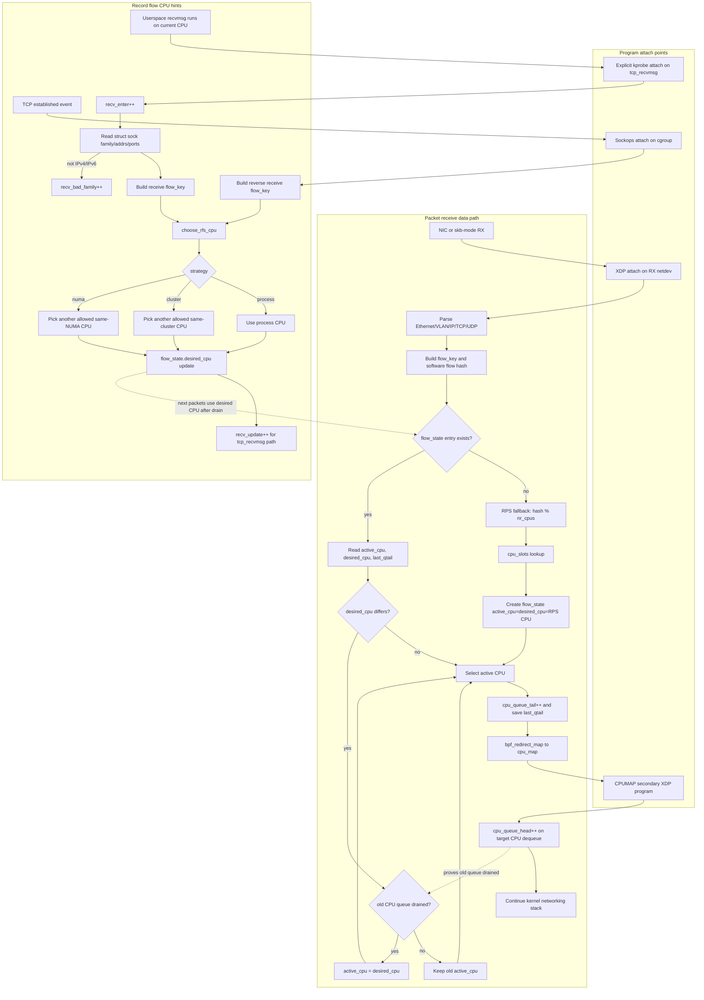
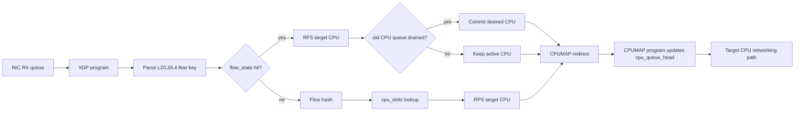
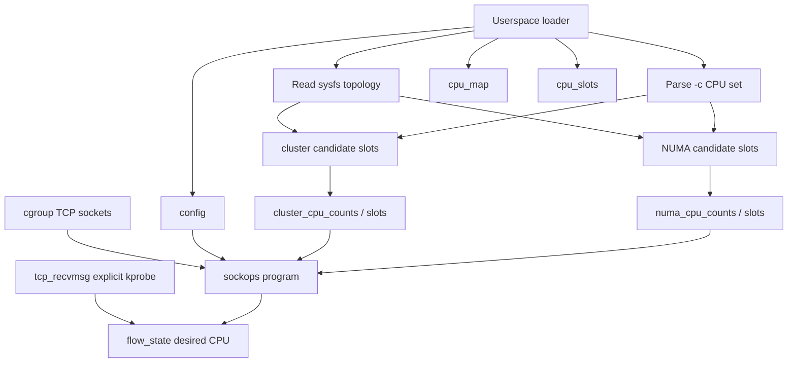
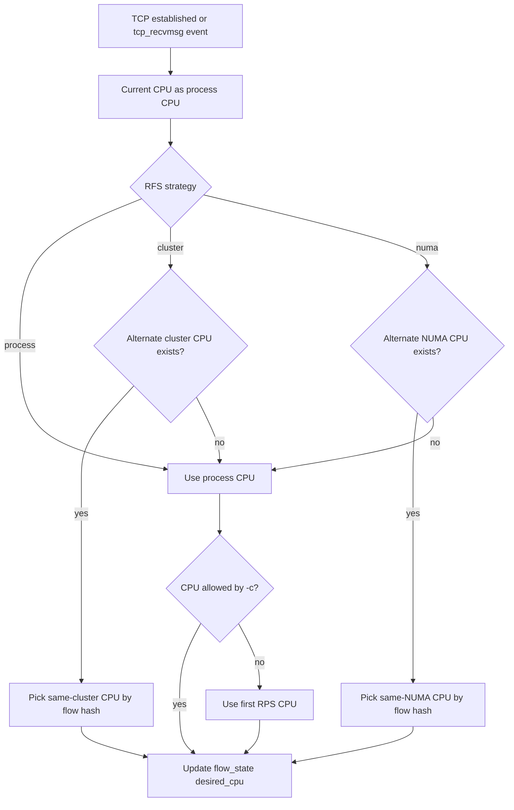
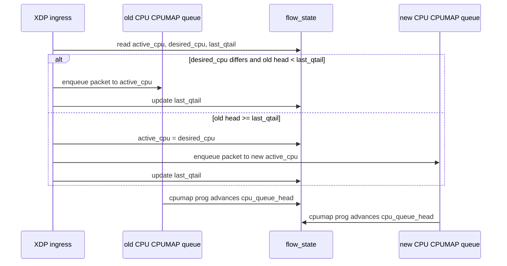
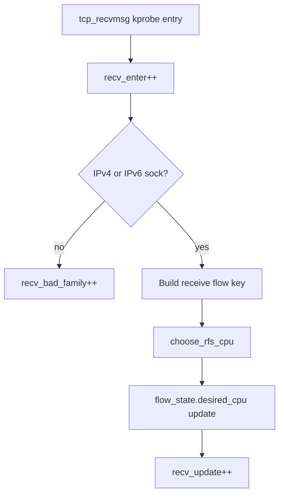

# eBPF RPS/RFS Steering Architecture

## End-to-end block flow



The key split is deliberate:

- XDP is the packet steering point. It never switches a flow directly to a new
  CPU unless the old CPUMAP queue has drained.
- Sockops and `tcp_recvmsg` are record-flow points. They only update
  `desired_cpu`.
- `xdp/cpumap` is the dequeue progress point. It advances `cpu_queue_head`,
  which lets XDP commit a pending migration without reordering packets.

## Data plane



## Control plane



## RFS strategy selection



## In-order migration



## Map relationships

```text
config
  nr_cpus
  rfs_strategy

cpu_slots[slot] -> cpu
cpu_map[cpu] -> cpumap entry
cpu_queue_head[cpu] -> dequeue progress
cpu_queue_tail[cpu] -> enqueue progress

allowed_cpus[cpu] -> bool

cluster_cpu_counts[process_cpu] -> count
cluster_cpu_slots[process_cpu * MAX_CPUS + slot] -> cpu

numa_cpu_counts[process_cpu] -> count
numa_cpu_slots[process_cpu * MAX_CPUS + slot] -> cpu

flow_state[flow_key] -> active_cpu, desired_cpu, last_qtail
stats[counter] -> per-CPU counter
```

## Receive-hook diagnostics



The test expectation for normal IPv4/IPv6 TCP receive traffic is:

```text
recv_enter > 0
recv_update == recv_enter
recv_bad_family == 0
```
