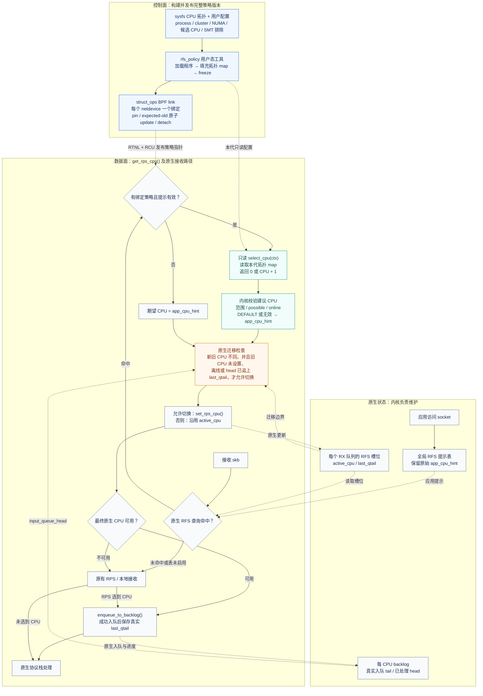
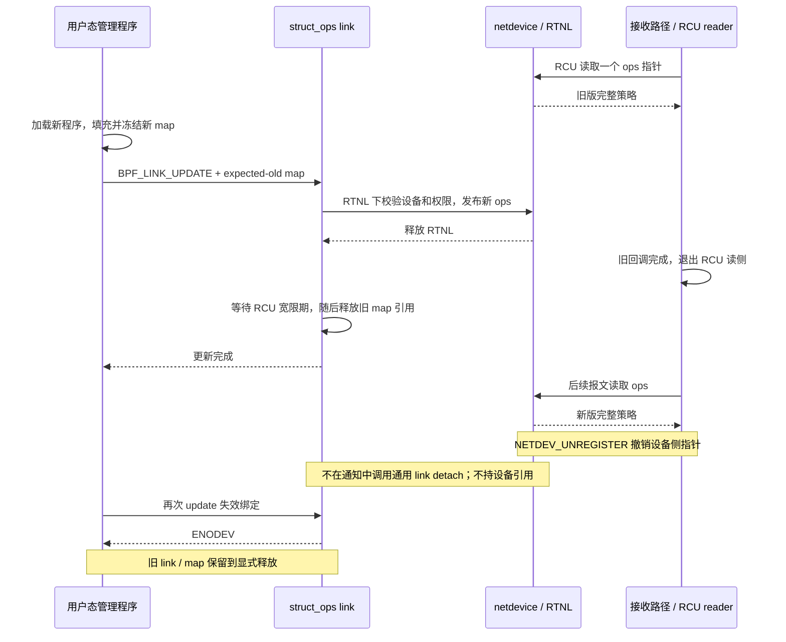

# 原生 RFS 的 BPF CPU 策略架构

对应四个提交 `e37739322a0c` → `9f3cd6a8fd24`。BPF 提供期望 CPU；
原生 RFS 决定何时改变 active CPU，并负责实际入队及队列进度。

可直接查看 [SVG 架构图](native-bpf-architecture.svg) 或
[PNG 架构图](native-bpf-architecture.png)，也可编辑
[Mermaid 源文件](native-bpf-architecture.mmd)。

## 三种 CPU 各自表示什么

| 名称 | 来源 | 含义 |
| --- | --- | --- |
| `app_cpu_hint` | 原生全局 RFS 提示表 | 应用访问 socket 时记录的 CPU 提示；不被 BPF 策略覆盖 |
| desired CPU | BPF 返回值经过内核校验，或原生提示 | 当前希望使用的 CPU；返回 0 表示 DEFAULT，CPU n 编码为 n + 1 |
| `active_cpu` | RX 队列的原生 RFS 槽位 | 当前处理该槽位流量的 CPU；是否切换取决于原生迁移条件 |

拓扑策略使用已有提示判断应用所在 cluster / NUMA node，并可保留仍然合适的
active CPU。全局 hash 表和 RX 槽位仍可能碰撞，它们不是精确 socket 归属记录。

## 控制面与数据面

<!-- The diagram below is synchronized with native-bpf-architecture.mmd. -->

实线表示主要执行路径，虚线表示配置发布或状态读写。图中的 RPS / 本地接收
是原有回退路径的概括：RPS 选到 CPU 时仍使用 backlog，否则保持本地接收。
原生迁移条件中的队列比较保持为有符号 `head - last_qtail >= 0`，图没有表示
一个新的、独立于原生 RFS 的保序机制。

控制面先准备完整程序及 map，再通过 link 发布；数据面不会读到一半更新的
拓扑。拓扑 map 同时使用 `BPF_F_RDONLY_PROG` 和用户态 freeze，统计 map 独立。
统计仅记录策略调用、建议和分支，不能解释为成功迁移或成功入队。

## 更新与设备删除

关键实现见 [内核钩子](../net/core/bpf_rfs.c)、
[get_rps_cpu() 接入点](../net/core/dev.c)、
[只读接口](../include/net/bpf_rfs.h) 和
[示例策略](../samples/bpf/rfs_policy.bpf.c)。
实际测试范围见 [实现报告](implementation-report.md)。
