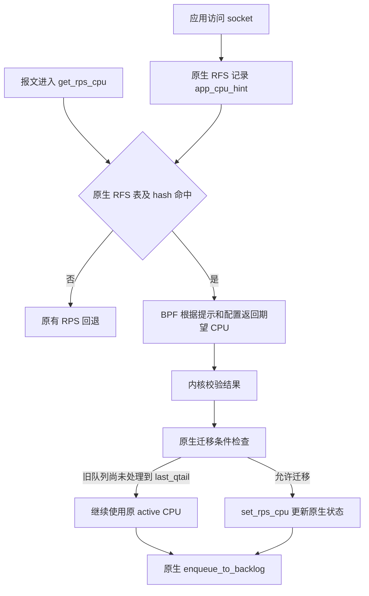

# 基于 BPF 的原生 RFS CPU 选择策略

状态：第一版已经实现，基于源码 `45c13f3f9e3b` 和此前对 `rfs-dev` 的审查。
接口、示例、功能测试和实际验收范围见
[实现报告](implementation-report.md) 与
[内核使用文档](../Documentation/networking/bpf_rfs.rst)。
本文保留完整设计与后续验收目标；第 9 节中的性能、硬件和压力场景
并非全部已经完成。原有 XDP/CPUMAP 实验保留。

## 1. 目标与方案选择

让 BPF 根据应用 CPU 提示、CPU 拓扑、接收设备及策略配置，计算 RFS 的
**期望 CPU**。内核继续决定何时迁移，并负责实际入队、队列进度和已有的
RFS/aRFS 状态管理。

这需要增加内核策略接口。修改范围集中在 RFS 选 CPU 的位置以及 BPF
注册、校验和生命周期支持；队列实现继续复用原生路径。

| 职责 | 归属 |
| --- | --- |
| 记录应用最近访问 socket 时的 CPU 提示 | 原生 `sock_rps_record_flow()` 等路径 |
| 计算期望 CPU，例如同 cluster 的其他 CPU | BPF 策略 |
| 校验 BPF 结果、判断旧队列是否允许迁移 | 内核 |
| 保存 active CPU、`last_qtail`，实际入队和推进 queue head/tail | 原生 RFS/backlog |
| CPU 拓扑发现、候选集合、策略加载和替换 | 用户态管理程序 |

第一版覆盖原生 RFS 命中的策略选择，以 TCP 场景作为主要验收对象。
未学习到应用提示的报文仍走原有 RPS 回退。暂不扩展 RPS miss 策略，
也不新增基于 PID、cgroup 或精确五元组的 socket 归属机制。

## 2. 数据路径与挂载点



具体位置在 `net/core/dev.c:get_rps_cpu()`：已经获得
`next_cpu = ident & net_hotdata.rps_cpu_mask`、`rflow` 和 `tcpu`，
但尚未执行 `tcpu != next_cpu` 及 queue head/last_qtail 判断。
只允许策略改变这里的 `next_cpu` 候选值。

原生 RFS 本来就区分全局表中的期望 CPU 和接收队列表中的当前 CPU，
并在迁移前检查旧 CPU 的 backlog 进度。新方案沿用这套机制。
参见 [内核网络扩展文档的 RFS 说明](https://docs.kernel.org/networking/scaling.html#rfs-receive-flow-steering)。

| 可选位置 | 取舍 |
| --- | --- |
| `get_rps_cpu()` 中的迁移判断之前 | 推荐。具备 RX 设备、队列和当前 CPU 信息；新策略从后续命中的报文开始参与决策 |
| `rps_record_sock_flow()` 记录提示时 | 调用频率可能较低，但缺少接收侧状态；直接存策略结果会覆盖原始应用 CPU 提示，更新或卸载后还需等待应用刷新 |
| XDP + CPUMAP | 需要独立实现流状态、重定向队列和迁移同步，无法直接复用原生 RFS 的 backlog 边界 |

不通过修改 `get_rps_cpu()` 的最终返回值来替代这个挂载点：最终 CPU
必须与 `rflow` 及调用方保存的 `last_qtail` 配套，单独改返回 CPU 会破坏这种关系。

## 3. 内核与 BPF 的接口

### 3.1 使用 struct_ops

新增一个 `BPF_PROG_TYPE_STRUCT_OPS` 对应的 `bpf_rfs_ops` 类型，使用
BPF link 管理挂载、替换和卸载。复用 struct_ops 框架，无需增加一种
BPF program type。当前树的 TCP congestion control 和 HID BPF 可作为
回调注册、设备绑定等局部实现的参考，但需要专门实现 RFS 的 verifier
规则和设备生命周期，不能仅复用它们的访问权限。

第一版每个 netdevice 最多绑定一个策略；策略可以根据 `rx_queue` 细分行为。
初次挂载以调用者网络命名空间中的 ifindex 定位设备，并检查相应权限。
绑定后持有的是实际设备身份，后续操作不重新解释调用者命名空间中的同名 ifindex。

接口示意：

```c
/* Proposed BTF interface; not an existing kernel API. */
struct bpf_rfs_ctx {
	__u32 flow_hash;
	__u32 ifindex;
	__u32 rx_queue;
	__u32 rx_cpu;
	__s32 app_cpu_hint;
	__s32 active_cpu;
	__u32 nr_cpu_ids;
	__u32 flags;
};

struct bpf_rfs_ops {
	__u32 ifindex;
	__u32 flags; /* Reserved; must be zero in v1. */
	char name[16];
	__u32 (*select_cpu)(const struct bpf_rfs_ctx *ctx);
};

/* Zero-initialized/default stubs preserve native RFS behavior. */
#define BPF_RFS_DEFAULT 0U
#define BPF_RFS_CPU(cpu) ((__u32)(cpu) + 1U)
```

上述只展示用户可配置元数据和回调；设备、link、引用计数及 RCU 状态放在
内核私有 binding 中，不能作为 BPF 可写成员暴露。

### 3.2 Context 的精确定义

| 字段 | 语义 |
| --- | --- |
| `flow_hash` | 本次原生 RFS 查询使用的 hash；不是全局唯一的流 ID |
| `ifindex` | 绑定设备的接口索引，由绑定所属 netns 解释 |
| `rx_queue` | 本次使用的原生接收队列编号；skb 未记录队列时为原生默认队列 0 |
| `rx_cpu` | 执行本次接收路径的 CPU，与应用 CPU 是不同信息 |
| `app_cpu_hint` | 从原生全局 RFS 表解码的最近应用 CPU 提示 |
| `active_cpu` | 原生接收队列 RFS 槽位当前记录的 CPU；未设置时为 -1 |
| `nr_cpu_ids` | CPU ID 的上界，便于策略检查配置；不代表所有 ID 都 possible 或 online |
| `flags` | 拟定义 `RX_QUEUE_RECORDED`、`APP_CPU_ONLINE`、`ACTIVE_CPU_ONLINE` 等快照标志 |

只有原生 RFS 查询命中且应用提示 CPU 编号可用时才调用策略。应用提示
CPU 已离线时可以继续提供提示及清零的 online 标志，让策略选其他 CPU。
无表、无 hash、未命中或提示编码无效时，不调用策略，保留原有处理。

这些字段是只读快照，不是同时冻结的全局状态。`app_cpu_hint` 是原生
启发式提示：应用可能已经迁移，多个线程也可能访问同一 socket。
`active_cpu` 属于 hash 槽位，不能把它解释为精确五元组的独占状态。

不传入 `skb`、`sock`、`rflow` 或 softnet 队列指针。第一版策略不能读取
报文负载，也不能直接获得所属进程或 cgroup；以后如有明确需求，再评估
增加只读元数据及其成本。

### 3.3 返回值、校验与回退

| 返回值/情况 | 内核行为 |
| --- | --- |
| `BPF_RFS_DEFAULT`，即 0 | 使用原生 `app_cpu_hint` 作为期望 CPU |
| `BPF_RFS_CPU(n)`，即 n + 1 | 请求把期望 CPU 设为 n |
| n 越界、非 possible、offline，或无法由原生 CPU 字段表示 | 记录无效返回，恢复原生期望 CPU |
| 未挂策略 | 使用完整原生路径 |
| 原生 RFS 未命中 | 使用完整原生 RPS 回退路径 |

CPU 0 编码为 1；零初始化的结果和默认回调不会误指向 CPU 0。
解码后必须先检查 `n < nr_cpu_ids`、`cpu_possible(n)`、`cpu_online(n)`，
并满足当前 `rflow->cpu` 的表示范围，即 `n < RPS_NO_CPU`。
只有通过检查后才能使用这个 CPU 访问 per-CPU 数据。

**DEFAULT 和无效返回都回到“原生期望 CPU”，随后仍执行原有迁移判断。**
不能直接跳转到 RPS hash 回退、直接在本 CPU 处理或直接返回应用 CPU，
因为旧 active CPU 上可能还有报文。

候选 CPU 集合属于策略偏好，并非 cpuset 或严格的 CPU 执行边界。
例如返回 DEFAULT 后，原生应用 CPU 可以在该集合之外。原生 `rps_cpus`
继续控制 RPS 回退，不把它重新解释成 RFS 的硬约束。
若未来需要严格隔离，需要单独定义无可用 CPU、在途报文和迁移过渡期语义。

### 3.4 执行约束

- 回调在接收路径和已有 RCU 读侧临界区内执行，必须 non-sleepable。
- verifier 要拒绝写 context；C 中的 `const` 本身不足以保证只读。
- 允许必要的 BPF map 查询、策略统计等操作；按实际执行上下文限制 helper
  和 kfunc，不能借回调改变报文、重定向或修改内核 RFS 状态。
- 使用有界工作量，避免逐包扫描所有 CPU；第一版不新增读取调度器内部状态的 kfunc。
- 无策略时使用 static key 跳过 context 构造和 BPF 执行。
  无策略及 DEFAULT 策略的实际开销都要测量，不能预先宣称零开销。

## 4. 保留原生迁移协议

以下仅展示挂载位置和变量关系；实际补丁应保留当前原生代码的完整分支、
并发访问方式及 aRFS 处理：

```c
native_cpu = ident & net_hotdata.rps_cpu_mask;
next_cpu = native_cpu;
rflow = native_rx_queue_flow_slot;
tcpu = rflow->cpu;

if (policy_present && usable_native_hint(native_cpu)) {
	encoded = run_policy(read_only_context);
	if (encoded != BPF_RFS_DEFAULT && valid_cpu(encoded - 1))
		next_cpu = encoded - 1;
}

/* Existing native RFS transition protocol. */
if (tcpu != next_cpu &&
    (tcpu >= nr_cpu_ids || !cpu_online(tcpu) ||
     (s32)(READ_ONCE(per_cpu(softnet_data, tcpu).input_queue_head) -
	   rflow->last_qtail) >= 0)) {
	tcpu = next_cpu;
	rflow = set_rps_cpu(dev, skb, rflow, next_cpu, hash);
}

if (tcpu < nr_cpu_ids && cpu_online(tcpu)) {
	*rflowp = rflow;
	return tcpu;
}

/* Continue with the existing native RPS fallback. */
```

设计不变量：

1. 全局 RFS 表始终保存原生应用 CPU 提示；BPF 的结果不写回该表。
2. 接收队列 RFS 槽位中的 CPU 和 `last_qtail` 始终由原生路径维护。
3. 策略换版本、返回 DEFAULT、卸载时，现有槽位继续存在，迁移仍需通过同一判断。
4. 真实入队与 queue tail 记账保持在 `enqueue_to_backlog()`；入队失败不产生虚构尾序号。
5. queue head 继续由原生 backlog 处理路径推进，不以 CPUMAP 回调或策略执行代替。
6. `set_rps_cpu()` 可能因 aRFS 返回另一个 `rflow`，必须保留返回值及调用方的配套记账。

例：active CPU 为 3，`last_qtail = 120`，CPU 3 的 queue head 为 117，
新策略请求 CPU 5。此时报文继续发往 CPU 3，随后实际入队会更新尾序号。
只有后续查询发现 head 已追上届时最新的 `last_qtail`，才允许切到 CPU 5。
不能固定等待最初的 120，更不能在加载新策略时重置状态。

高持续负载下，旧 CPU 可能长时间追不上最新尾序号，策略生效也就会延后。
这是复用原生排空条件的代价；不能以超时强制迁移来伪装成即时生效。

这里继承的是原生 RFS 的迁移机制和适用前提，不是任意网络条件下的绝对
无乱序保证。CPU hotplug、NIC/RSS 队列重配置、原生表重置、hash 冲突和
上游网络本身的乱序仍需按原生语义评估。BPF 不能把它们自动消除。

## 5. 第一版策略与拓扑数据

### 5.1 三个基础策略

| 策略 | 选择规则 |
| --- | --- |
| `process` | 返回 DEFAULT，作为原生行为和 BPF 调用成本的基线 |
| `cluster_other` | 在 app CPU 所属 cluster 的候选集合中选另一 CPU |
| `numa_other` | 在 app CPU 所属 NUMA node 的候选集合中选另一 CPU |

`cluster_other` 的默认降级链建议为：同 cluster 其他候选 CPU → 同 NUMA
其他候选 CPU → 在候选集合中的 app CPU → 全局候选集合 → DEFAULT。
`numa_other` 从同 NUMA 一步开始。各级均先检查候选数；集合为空时禁止取模。
用户态把采用的降级规则展示出来，避免策略名称掩盖实际跨 NUMA 选择。

集合内采用原生 `flow_hash` 的确定性选择，避免总落到第一个 CPU。
若 `active_cpu` 仍满足当前层级、排除规则和候选条件，优先保留它以减少
不必要的迁移。应用迁移导致原 active CPU 不再符合目标拓扑时，再选择新 CPU。

“其他 CPU”默认只排除同一个逻辑 CPU。若目标是减少物理核心竞争，应
提供 `exclude_smt_siblings` 配置，同时排除 app CPU 的 SMT siblings。
cluster、LLC 和 NUMA 是不同拓扑概念；缺失 cluster 信息时明确报告并降级，
不直接把整个 package 当作 cluster。后续可以独立增加 `llc_other`。

### 5.2 用户态预计算，BPF 做少量查表

用户态完整解析 possible、online、NUMA、cluster、core/sibling 信息，
再与用户候选集合求交集。所有 map 容量根据 CPU ID 上界和实际分组计算，
不能使用固定的 `MAX_CPUS = 64`，也不能先因系统有大于 63 的 CPU 就拒绝启动。

建议布局：

| Map/配置 | 内容 |
| --- | --- |
| `cpu_topology[cpu]` | node、cluster、core 及所属候选组编号 |
| `group_desc[group]` | 候选槽位起点、数量和分组类型 |
| `cpu_slots[index]` | 按组连续存放的候选 CPU |
| `cpu_membership[cpu]` | 候选资格、组内 rank，以及需要排除的 core 区间 |
| 只读策略配置 | 策略类型、SMT 排除规则、配置版本等 |
| per-CPU 统计 map | 策略分支计数；不保存排队或迁移权威状态 |

同一组由多个 app CPU 共享，避免原方案为每个 CPU 展开完整 CPU 列表而
产生的平方级存储。固定数量的拓扑层级下，存储规模近似随 CPU 数线性增长。

候选 CPU 可按 core 分组，使需要排除的同一逻辑 CPU或同一 core 成为
可直接跳过的区间：在 `count - excluded_count` 上散列，再映射回实际 rank。
这样不需要在 BPF 中遍历全机 CPU。描述符和 map 查询失败时返回 DEFAULT。

第一版不做逐包负载探测。后续负载策略可读取用户态定期更新的采样数据，
但必须增加滞回规则，并验证是否因频繁迁移损失局部性。

## 6. 配置发布、link 和生命周期

### 6.1 一次发布一个完整策略版本

每一代程序使用自己的一组拓扑及只读配置 map：先加载、填充并校验，再
通过同一 link 原子替换到新 `struct_ops` map。对只读配置使用相应的
用户态冻结和程序只读约束；统计 map 独立保持可写。
不能原地依次修改 count、slots 和 group，使一个回调读到混合版本。

替换后，在途回调可以完成旧版本；后续回调读取新版本。每次调用始终使用
同一套配置。需要用已有 struct_ops 的 `.update` 回调实现子系统侧切换，
并通过 expected-old map 防止覆盖非预期版本。

### 6.2 绑定和回收协议

设备侧保存一个 RCU 保护的策略指针，快速路径只取指针快照并调用策略。
控制面负责以下协议：

- `.reg` 校验设备状态、权限、保留字段和回调；一个设备及一个 struct_ops
  实例各自只允许一个有效绑定。冲突时返回错误，不替换已有策略。
- `.update` 仅替换现有 link 对应设备上的策略；拒绝借更新迁移到另一设备，
  也拒绝复用已在其他 link 上生效的实例。发布新 binding 后等待旧读者退出。
- `.unreg` 撤销设备侧指针，等待旧读者退出，再释放私有资源；重复的设备
  清理和 link 清理必须安全，不能二次释放。
- 当前通用 struct_ops link 更新会在 `.update` 返回后释放旧 map 引用。
  因此子系统必须在返回前完成所需 RCU 宽限期，或另持显式引用延后回收；
  第一版选择前者。不能仅切换指针就假定旧 trampoline 仍然存活。
- 不在逐包路径获取 RTNL、不执行可睡眠操作、不修改 binding 的生命周期状态。

设备删除或跨 netns 移动时撤销绑定；不能把旧策略跟随到重用的 ifindex。
实现中的控制面 binding 不持有设备引用；RTNL 串行化设备查找和清理。
通知撤销设备侧指针并清空 binding 的设备指针，避免 pinned link 阻塞
设备注销。失效 link 不再允许策略更新。

这里有一个需要在实现中明确处理的锁序：通用 struct_ops 控制路径持有
`update_mutex` 后调用 `.reg/.update/.unreg`，这些回调可能需要 RTNL。
所以持有 RTNL 的设备通知路径不能同步反向调用 link detach，否则会产生
RTNL → `update_mutex` 与 `update_mutex` → RTNL 的倒置。
实现选择在通知路径撤销 binding，不主动调用通用 link detach，也不调度
异步 detach。失效 link/map 保留到用户释放，期间不再调用策略；随后
`.unreg` 等待 RCU 宽限期并释放 binding。link 的 map ID 不代表设备仍在绑定。
设备删除与 link update 的并发测试已经在 lockdep/KASAN 内核中通过。

### 6.3 用户态管理约定

长期生效时 pin **link**，仅 pin 数据 map 不等同于保留挂载。
首次挂载成功后再发布管理路径；失败时保留旧 link、旧 map 和旧 pins。
已有 pinned link 用于后续策略更新，不先删除旧 pins 再尝试挂载。

管理程序普通退出只关闭自己的 FD；显式 detach 是单独操作。
旧程序退出不能无条件卸载别人已更新的策略。当前 `show` 展示 link ID 和
map ID；挂载/更新时输出设备名和模式。设备存活状态、program ID 和配置版本
的完整查询接口留作后续管理工具增强。

## 7. 与现有 RFS 的兼容边界

- **启用条件：** 仍需原生 `CONFIG_RPS`、全局 `rps_sock_flow_entries` 和
  对应 RX 队列的 `rps_flow_cnt`。加载 BPF 不自动创建这些表；管理程序检查并提示。
- **协议范围：** 复用原生 hash 与应用提示，不新增 XDP 五元组解析，因而不再
  引入原方案独立解析器和两套 hash 不一致的问题。但并非所有 UDP、转发或
  尚未建立关联的流量都具备原生 RFS 提示，需要按实际调用路径验证覆盖范围。
- **隔离范围：** 策略绑定按 netdevice/netns 隔离；当前全局 RFS 提示表仍是
  全局的、基于 hash 的近似关联。不能据此声称应用提示已经具备租户级精确隔离。
  若需要强隔离，应另行设计按 netns 分离的提示或更强标识，并评估内存和查询成本。
- **CPU hotplug：** online 标志与策略 map 都可能过时，内核再次校验结果，
  最终路径继续使用原生 online 判断及 CPU 下线处理。不能用可睡眠锁冻结接收路径；
  用户态异步刷新拓扑。该方案不承诺比原生 RFS 更强的 hotplug 保序语义。
- **aRFS：** 保留 `set_rps_cpu()` 中原有硬件队列映射和 filter 操作。先验收
  软件 RFS，再单独测试硬件支持、规则容量不足及 filter 更新失败的降级。
- **表调整：** 策略更新不 resize/clear 原生 RFS 表。管理员重置原生表会影响
  其已有状态，不能把这种行为包装成无缝策略切换。

## 8. 实现拆分

以下是实现拆分；前三项和第四项的功能测试已经完成，性能测量待进行。

| 阶段 | 范围 | 验收重点 |
| --- | --- | --- |
| 1. 内核接口与默认策略 | `include/net/bpf_rfs.h`、`net/core/bpf_rfs.c`；`net_device` 私有 binding；`get_rps_cpu()` 插入点；Kconfig/Makefile | 未挂载和 DEFAULT 保持原生行为；无效返回不能绕过迁移判断 |
| 2. 注册与生命周期完整化 | struct_ops verifier、link update、RCU、netdevice/netns 清理 | 替换和卸载无 UAF、无死锁；在途报文继续使用原生状态 |
| 3. 示例和管理工具 | `samples/bpf/rfs_policy.bpf.c` 及 loader；动态拓扑、三个基础策略、版本发布 | 大 CPU ID、SMT、空集合、配置回退、失败更新均可解释 |
| 4. 自动化验证和性能报告 | `tools/testing/selftests/bpf/` 及网络测试辅助程序 | 功能、迁移、异常生命周期和开销均有结果 |

新增配置项 `CONFIG_BPF_RFS`，依赖 RPS、BPF_SYSCALL、BPF_JIT 和
DEBUG_INFO_BTF。目标架构仍需支持 struct_ops/trampoline。
关闭配置时使用编译期 stub。第一版先避免引入模块卸载这一额外生命周期。

现有 XDP/CPUMAP sample 可保留为独立实验。新实现不复用其中的 LRU
`flow_state`、BPF queue head/tail、socket 私有偏移和全局 `tcp_recvmsg` kprobe。
可复用的是拓扑策略需求和用户操作经验，拓扑解析及管理工具应按新接口重新验证。

## 9. 测试与成功标准

### 9.1 行为和迁移

| 测试 | 必须观察到的结果 |
| --- | --- |
| 未挂策略、DEFAULT、RFS miss | 对应原生路径行为；miss 不调用策略 |
| CPU 0、最大合法 CPU、越界/possible/online 检查 | 返回值正确解码；无效值回到原生候选并继续检查旧队列 |
| 应用线程迁移、process/cluster/NUMA 策略 | 区分应用提示、建议目标和实际接收 CPU，结果符合策略及排空条件 |
| 旧 CPU backlog 被持续占用 | 新候选不能绕过 `head - last_qtail` 条件；尾序号继续随实际入队更新 |
| 快速替换策略、DEFAULT、卸载 | 不清空 active CPU/last_qtail；旧队列未处理完时继续使用旧 CPU |
| 队列溢出、入队失败和 tail 回绕 | 不因失败入队留下虚假尾序号；保留原生有符号差值语义 |
| IPv4、IPv6、mapped socket、分片、多个 RX 队列 | 使用原生 hash/提示语义，不新增独立解析差异；区分有提示和无提示的协议路径 |

不能只用 TCP 应用层 `recv()` 顺序作为“无乱序”证据：TCP 重组会掩盖
下层乱序。需要在协议重组之前观察带序号的报文，结合 native flow 槽位、
实际 backlog CPU 及 queue head/tail 的事件验证迁移；先在受控 RSS 队列下
确认基本协议，再测试多队列和配置变化。

### 9.2 生命周期与配置压力

覆盖加载失败、重复挂载、expected-old 不匹配、旧管理进程退出、设备删除、
netns 移动、CPU 下线与上线、拓扑更新滞后、只有一个候选 CPU、无候选 CPU、
超过 64 CPU 及稀疏 CPU ID。设备删除与 link update/detach 并发运行，并在
适用环境启用 lockdep、KASAN 和 RCU 检查。

同时评估原生表碰撞及压力下的行为；确认没有因新增 BPF LRU 驱逐而丢失
迁移状态。表重置等原生破坏性配置操作作为独立场景记录，不混入正常切换承诺。

### 9.3 性能与统计

同一 workload 对比 RSS 基线、原生 RFS、新内核未挂策略、DEFAULT BPF、
cluster 和 NUMA 策略。保持 CPU 亲和性、队列配置、offload 和应用参数一致。
记录吞吐、P50/P99 时延、CPU 使用率、策略执行成本、迁移次数、丢包及可用的
cache/NUMA 指标。分别展示收益与 BPF 逐次调用的代价。

统计要分清 `policy_called`、`default`、`invalid_cpu`、`migration_deferred`
和实际 `migration_committed`。BPF 的建议不等于已迁移，选中 CPU 不等于
成功入队。入队失败由原生路径统计；迁移结果在内核迁移判断处统计。

可提供默认关闭的诊断 tracepoint，包含设备、RX 队列、hash、app hint、
原 active CPU、候选 CPU、最终 CPU、决策原因和配置版本。hash 仍不能作为
唯一流标识，不在正常运行时逐包输出日志。

## 10. 源码依据与尚未验证的部分

本设计已对照当前树的以下路径；实现已完成编译、verifier 和功能验证，
并补充了 [Redis 双 NUMA VM 性能测试](test-results/redis-numa/report.md)。
物理 NUMA 和真实 NIC 收益仍待验证，完整记录见实现报告：

- `include/net/rps.h`：原生应用提示记录、CPU 字段及其提示属性。
- `net/core/dev.c:get_rps_cpu()`、`set_rps_cpu()`：选 CPU、迁移判断和 aRFS。
- `net/core/dev.c:enqueue_to_backlog()`、`process_backlog()`：真实队列边界。
- `net/core/sysctl_net_core.c`、`net/core/net-sysfs.c`：全局和接收队列 RFS 配置。
- `include/linux/bpf.h`、`kernel/bpf/bpf_struct_ops.c`：struct_ops 注册、link 更新和回收约定。
- `net/ipv4/bpf_tcp_ca.c`、`drivers/hid/bpf/hid_bpf_struct_ops.c`：已有子系统接入示例。

实现时最需要优先验证的是：插入点没有改变原生迁移条件；只读回调约束
确实由 verifier 执行；设备删除与 link 更新的锁序和引用完整；逐次策略
调用的收益能覆盖成本。这四项通过后，再扩展负载感知和更细的流分类策略。
