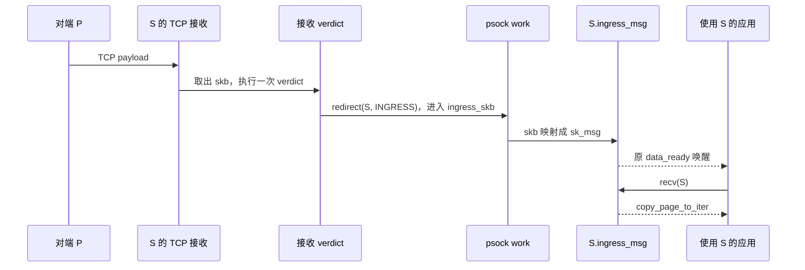

# sockmap verdict redirect 到同一个 socket 的完整收发路径

源码提交：`45c13f3f9e3bb15fd89ff2864c6f627a3b4b4229`。
本文描述该提交下实际实现；函数定义位置汇总在 [源码索引](source-index.md)。

## 1. 模型、方向与 verdict 类型

以一条普通 TCP 连接为例：

```text
进程 A                         进程 B
fd_P / socket P <--- TCP ---> fd_S / socket S
                              sockmap[0] = fd_S
```

程序挂在 map 上，socket 插入 map 时继承程序；BPF helper 查询 map 得到内核
`struct sock *`。只把 `S` 放到 key 0，并让运行在 `S` 上的程序 redirect 到
key 0，即构造 self-redirect。把 `P` 也插入同一张带程序的 map，可能让两端都
执行程序，会改变拓扑，不能与单端 self-redirect 混为一谈。

### 1.1 三种接收相关挂载与一种发送挂载

| 程序类型 / attach type | `sk_psock_progs` 字段 | 触发位置 | helper |
|---|---|---|---|
| `SK_SKB` / `BPF_SK_SKB_STREAM_PARSER` | `stream_parser` | TCP 接收流组装消息时 | 返回消息长度，负责分帧 |
| `SK_SKB` / `BPF_SK_SKB_STREAM_VERDICT` | `stream_verdict` | 已接收数据，或 parser 组装好的消息 | `bpf_sk_redirect_map/hash` |
| `SK_SKB` / `BPF_SK_SKB_VERDICT` | `skb_verdict` | 接收侧 `read_skb` | `bpf_sk_redirect_map/hash` |
| `SK_MSG` / `BPF_SK_MSG_VERDICT` | **`msg_parser`** | TCP 发送消息进入正常发包路径之前 | `bpf_msg_redirect_map/hash` |

`msg_parser` 虽然带 parser 字样，实际保存发送侧的 `SK_MSG_VERDICT` 程序。
`tcp_bpf_recvmsg_parser()` 名字也容易误导：只要存在接收 verdict 就选择它，
不要求真的附加 stream parser。

`stream_verdict` 与 `skb_verdict` 互斥；`SK_MSG` 可与接收 verdict 并存。
只挂 `STREAM_VERDICT`、不挂 `STREAM_PARSER`，当前代码也支持，走直接
`read_skb` 路径。源码：
[sock_map_link](../net/core/sock_map.c#L217)、
[tcp_bpf_update_proto](../net/ipv4/tcp_bpf.c#L725)。

### 1.2 ingress 是目标 socket 的方向

- `BPF_F_INGRESS`：把字节放入目标 socket 的 BPF 接收队列，供应用读取。
- `flags = 0`：使用目标 socket 发送字节；对于 TCP，接收者是目标 socket 的对端。
- 它不是网卡 ingress 标记，也不表示重新调用 IP/TCP 的收包入口。
- 本节的报文实际是 socket 层的数据。TCP 报文段、GRO 后的 skb、parser 消息、
  一次 `send()` 和一次 `recv()` 的边界不必一致。

## 2. socket 插入 map 后，哪些入口被替换

典型配置顺序：创建 map → attach 程序 → 建立 TCP 连接 → 将已连接的 `S` 插入 map。
`sock_map_link()` 在插入时读取 map 的程序，不能把“map attach 已成功”直接等同于
“之前已插入的 socket 已继承新程序”。做最小验证时采用上述顺序。

```text
bpf(BPF_MAP_UPDATE_ELEM, map, key=0, value=fd_S)
  → sock_map_update_elem_sys()
    → sockfd_lookup()                         fd → socket → sock
    → sock_map_sk_acquire()                  lock_sock + RCU
    → sock_map_update_common()
      → sock_map_link()
        → sk_psock_init() 或取得已有 psock
        → 继承 map 中的 progs
        → sock_map_init_proto()
          → tcp_bpf_update_proto()
        → sk_psock_start_verdict() 或 sk_psock_start_strp()
```

`sk_psock_init()` 保存原协议函数和回调，初始化队列及 work，并通过
`sk_user_data` 发布 psock，同时持有 socket 引用。

### 2.1 TCP 协议函数表选择

| 配置 | `sendmsg` | `recvmsg` | 接收数据回调 |
|---|---|---|---|
| 只有 psock，未继承收发 verdict | 原 `tcp_sendmsg` | `tcp_bpf_recvmsg` | 原回调 |
| 只有 `SK_MSG` | `tcp_bpf_sendmsg` | `tcp_bpf_recvmsg` | 原回调 |
| 有接收 verdict，无 `SK_MSG` | 原 `tcp_sendmsg` | `tcp_bpf_recvmsg_parser` | verdict / strparser 回调 |
| 同时有 `SK_MSG` 与接收 verdict | `tcp_bpf_sendmsg` | `tcp_bpf_recvmsg_parser` | verdict / strparser 回调 |

另替换 `close`、`destroy`、`ioctl`、`sock_is_readable` 等钩子。
接收 verdict 模式保存原 `sk_data_ready`，再把它替换成：

- 无 parser：`sk_psock_verdict_data_ready`。
- stream parser + stream verdict：`sk_psock_strp_data_ready`。

`sk_write_space` 替换为 `sk_psock_write_space`，用于唤起暂停的 psock work。

### 2.2 对象与三个不同的队列

| 对象/队列 | 放什么 | 谁消费 |
|---|---|---|
| `sk->sk_receive_queue` | TCP 原生接收 skb | `tcp_read_skb` / `tcp_read_sock_noack` / 原生 `tcp_recvmsg` |
| `psock->ingress_skb` | 等待 redirect 或慢路径处理的 skb，**包含 egress 请求** | `sk_psock_backlog` 工作队列 |
| `psock->ingress_msg` | 已准备好供应用读取的 `sk_msg`，里面是 scatter-gather 页片段描述 | BPF 版本 `recvmsg` → `__sk_msg_recvmsg` |
| `sk->sk_backlog` | socket 被进程持锁时推迟执行的协议层收包 | `release_sock` 的 backlog 处理 |

`ingress_skb` 的名字不能用来判断最终收发方向；真正的方向保存在 skb redirect 元数据中。
`sk_backlog` 与 `ingress_skb` 也不是同一个队列。

## 3. 普通发送如何到达 S 的接收 verdict

这里先由 `P` 执行 `send(P, data, N, 0)`，`S` 尚未开始 redirect。

### 3.1 P 的发送链

```text
send(P) / sendto(P)
  → __sys_sendto()
    → __sock_sendmsg() → sock_sendmsg_nosec()
      → inet_sendmsg() → sk->sk_prot->sendmsg
        → tcp_sendmsg() → lock_sock(P)
          → tcp_sendmsg_locked()
            → 准备/扩展发送 skb、拷贝或挂入页片段
            → write_seq / skb end_seq 增加
            → tcp_push()
              → __tcp_push_pending_frames() → tcp_write_xmit()
                → tcp_transmit_skb() → __tcp_transmit_skb()
                  → ip_queue_xmit() → __ip_queue_xmit()
                    → ip_local_out() → dst_output() → ip_output()
                      → ip_finish_output() → 邻居/设备发送路径
```

`sendmsg()` 的系统调用封装不同，但也汇入 socket/proto 的发送入口。
上图展示普通 IPv4 已连接数据路径，路由、拥塞窗口、Nagle、分段、netfilter、
qdisc 等可能使实际发包延后、分段或终止，不能把调用一次 `send()` 当作立即发出一个 skb。
若 `P` 也继承 `SK_MSG`，应先套用第 6 节的发送 verdict 路径。

### 3.2 S 的 TCP 接收链

```text
网络设备/NAPI（本机连接则走 loopback）
  → IP 接收分发：ip_rcv / 列表接收变体
    → ip_local_deliver() → ip_protocol_deliver_rcu()
      → tcp_v4_rcv()                         查找到 S
        ├─ 未被进程持锁 → tcp_v4_do_rcv()
        └─ 被进程持锁   → tcp_add_backlog()
                           → release_sock() 后执行协议 backlog
          → tcp_rcv_established()
            → 校验、按 TCP 序号接收、处理 ACK/窗口
            → tcp_queue_rcv() 或 tcp_data_queue()
              → S.sk_receive_queue；推进 rcv_nxt
            → tcp_data_ready(S)
              → S.sk_data_ready(S)
```

只有满足 `tcp_data_ready()` 的可读条件，或 socket 已 DONE，才调用数据回调。
乱序数据先经 TCP 的乱序队列处理；接收 verdict 不在 SYN 握手或每个 IP 包的最前端执行。
普通纯 ACK 不会作为应用 payload 送给 verdict。

### 3.3 无 parser 时如何取出 skb

```text
sk_psock_verdict_data_ready(S)
  → S.sk_socket->ops->read_skb(S, sk_psock_verdict_recv)
    → tcp_read_skb()
      → 从 sk_receive_queue 摘下整个 skb
      → skb_set_owner_sk_safe(skb, S)
      → sk_psock_verdict_recv(S, skb)
        → 清理旧 redirect 元数据及 dst
        → bpf_prog_run_pin_on_cpu(stream_verdict 或 skb_verdict, skb)
        → sk_psock_map_verd()
        → sk_psock_verdict_apply()
```

此时 `skb->sk = S`，并通过 `sock_efree` 析构函数持有 `S` 的引用。
`tcp_read_skb()` 调用的是 `skb_set_owner_sk_safe()`，它会先 orphan skb，
所以原先的接收内存记账会被撤销。后续 ingress 需要重新建立接收所有权。
详见第 9 节。

与 `tcp_recv_skb(sk, copied_seq, &offset)` 不同，当前 `tcp_read_skb()`
不会先根据 `copied_seq` 裁掉已被原生 `recv()` 消费的前缀；若中途接入 sockmap，
不能默认这里的整个 `skb->len` 都是新数据。

## 4. 接收侧 SK_SKB：redirect 到自身 ingress

### 4.1 helper 只记下目标和方向

示意 BPF 程序：

```c
SEC("sk_skb/stream_verdict")
int self_ingress(struct __sk_buff *skb)
{
	return bpf_sk_redirect_map(skb, &sock_map, 0, BPF_F_INGRESS);
}
```

其中 `sock_map[0]` 必须存入运行本程序的 `S`。

[bpf_sk_redirect_map](../net/core/sock_map.c#L647) 做的事情是：

1. 拒绝 `BPF_F_INGRESS` 之外的 flags。
2. 查询目标 socket，并检查是否允许 redirect；TCP listener 不允许作为目标。
3. `skb_bpf_set_redir(skb, S, true)` 将目标指针和方向编码到 `skb->_sk_redir`。
4. 成功返回 **`SK_PASS`**，失败返回 `SK_DROP`。

没有“目标等于源，所以拒绝”的判断，也没有在 helper 内调用 TCP 发送或 `recvmsg`。
`sk_psock_map_verd()` 根据“程序返回 `SK_PASS` 且有 redirect 目标”转为
内部 `__SK_REDIRECT`；`SK_PASS` 且无目标才是内部 `__SK_PASS`。
这些 `__SK_*` 是内核内部状态，不应让 BPF 程序直接返回内部 `__SK_REDIRECT`。
`bpf_sk_redirect_hash()` 除查表方式外采用同样的数据路径。

### 4.2 从 verdict 转到工作队列

```text
sk_psock_verdict_apply(psock_S, skb, __SK_REDIRECT)
  → tcp_eat_skb(S, skb)                     消费源 TCP 序号，见第 8 节
  → sk_psock_skb_redirect(psock_S, skb)
    → 从元数据提取目标 S
    → 查到 psock_S，检查 SOCK_DEAD / TX_ENABLED
    → spin_lock_bh(psock_S.ingress_lock)
    → skb_queue_tail(psock_S.ingress_skb, skb)
    → schedule_delayed_work(psock_S.work, 0)
    → 解锁并返回
```

对 self-redirect，`psock_other == from`，仍然走这条公共路径。
helper 成功只表示已经选出目标；后续入队失败、分配失败、socket 关闭或发送失败，
不会通过 helper 的返回值追溯报告给 BPF 程序。

### 4.3 work 把 skb 变成应用可读的 sk_msg

```text
sk_psock_backlog(psock_S.work)
  → 检查 TX_ENABLED，获取 psock 引用
  → mutex_lock(work_mutex)
  → peek ingress_skb 队首
  → 得到 off / len，读取 ingress=true，清除 skb redirect 元数据
  → sk_psock_handle_skb(psock_S, skb, off, len, true)
    → sk_psock_skb_ingress()
      → skb->sk == S，因此走 sk_psock_skb_ingress_self(..., take_ref=true)
        → alloc_sk_msg(GFP_ATOMIC)
        → skb_set_owner_r(skb, S)
        → msg->sk = S
        → sk_psock_skb_ingress_enqueue()
          → skb_to_sgvec()                   建立数据页的 SG 描述
          → msg->skb = skb_get(skb)
          → sk_psock_queue_msg()            加入 ingress_msg，增加 msg_tot_len
          → sk_psock_data_ready()           唤醒应用
  → 本 skb 全部处理成功：从 ingress_skb 摘除，kfree_skb()
  → 解锁，释放 psock 引用
```

这里通常只是建立 skb 数据的 SG 视图，没有第二次 TCP 接收，也不必复制 payload。
若 skb 的 fragment 数过多，`skb_to_sgvec()` 失败后尝试 `skb_linearize()`，
因此不能声称该路径绝对零拷贝。

work 持有的 skb 引用释放后，`msg->skb` 持有的引用继续保证数据有效。
应用读完该 `sk_msg` 才会释放最后的数据引用，详见第 7、9 节。

以上按 work 先释放、应用后读取描述。如果应用在 work 出队之前已读完 msg，
最后的 skb 引用则由 worker 释放；相应记账并发见 [补充分析](backlog-locking.md)。

### 4.4 为什么不会再次运行接收 verdict

数据进入的是 `psock->ingress_msg`，没有重新放回 `sk_receive_queue`，也没有调用
`tcp_v4_rcv()`。通知应用时，`sk_psock_data_ready()` 优先调用保存的
`saved_data_ready`，普通 socket 下就是原来的 `sock_def_readable()`。
因此不会再次调用已替换的 `sk_psock_verdict_data_ready()` 来处理同一份数据。



### 4.5 与直接返回 SK_PASS 的差异

两者都可能让 `recv(S)` 得到原生接收的数据，但当前实现不是同一路径：

| 项目 | 直接 `SK_PASS`，未设置 redirect 目标 | redirect 到 `S` 的 ingress |
|---|---|---|
| 内部判定 | `__SK_PASS` | `__SK_REDIRECT` |
| `tcp_eat_skb()` | 正常成功路径不调用 | 无 parser 时先调用 |
| 入应用队列 | 队列空且分配成功时直接完成 | 先排入 `ingress_skb`，由 work 完成 |
| 原 skb 引用 | 直接成功时把现有引用交给 msg，`take_ref=false` | work 处理时额外 `skb_get`，`take_ref=true` |
| 接收序号 | 本 socket 数据读出时推进 | 当前无 parser self-ingress 存在重复推进问题 |

直接 `SK_PASS` 在 work 队列非空或直接入队失败时，也会改走 work，
避免后来的数据通过直接入口超越已经排队的数据。
“self redirect 等同于 SK_PASS”最多是数据去向的简化描述，不能用于解释源码或记账。

## 5. 接收侧 SK_SKB：redirect 到自身 egress

helper 改为：

```c
return bpf_sk_redirect_map(skb, &sock_map, 0, 0);
```

前半段仍是第 3、4 节的 TCP 接收、执行 BPF 和排入 `S.ingress_skb`。
区别出现在 work 的方向分派：

```text
sk_psock_backlog()
  → sk_psock_handle_skb(..., ingress=false)
    → sock_writeable(S)                     不可写则 -EAGAIN
    → skb_send_sock(S, skb, off, len)
      → __skb_send_sock(..., sendmsg_unlocked)
        ├─ skb 线性部分 → kvec → iov_iter_kvec
        └─ 页片段部分   → bio_vec → iov_iter_bvec，MSG_SPLICE_PAGES
        → sendmsg_unlocked()
          → sock_sendmsg(S.sk_socket, &msg)
            → inet_sendmsg()
              → S.sk_prot->sendmsg
                → 无 SK_MSG：tcp_sendmsg() → tcp_sendmsg_locked()
                → 有 SK_MSG：tcp_bpf_sendmsg() → 第 6 节
```

无额外 `SK_MSG` 政策时，最终调用普通 TCP 发送路径，使用 **S 的发送序号和连接状态**，
数据发给 `P`。这是 socket 层的 payload 回显，不是修改原 IP 包头后原样转发。
TCP 会构造发送 skb 和协议头；可利用原数据页，不等于原接收 skb 直接成为线上报文。

`__skb_send_sock()` 使用 `MSG_DONTWAIT`，并为尚未送完的 TCP 数据设置 `MSG_MORE`。
允许部分发送；work 记录 `off/len` 后续继续，全部完成后释放原接收 skb。
成功交给 TCP 发送队列也不等于对端应用已读取。

### 5.1 再次执行什么程序

- 接收 verdict 本身不会因为调用发送入口而递归执行。
- **目标的 `SK_MSG` 可能执行**，因为本路径调用的是 `sock_sendmsg()`，经过当前协议函数表。
- 若该 `SK_MSG` 又 redirect 到自身 ingress，原本回显的数据会进入本地
  `ingress_msg`，后续不再发到网络；其接收消息标记与原 skb self-ingress 不同。
- 若两个 TCP 对端均安装无条件的接收侧 self-egress 回显，会发生连接两端反复发送；
  那是新的网络接收事件造成的数据循环，不是 helper 的同步递归。

## 6. 发送侧 SK_MSG：send(S) 如何 redirect 给 S

发送侧程序示意：

```c
SEC("sk_msg")
int self_msg(struct sk_msg_md *msg)
{
	return bpf_msg_redirect_map(msg, &sock_map, 0, BPF_F_INGRESS);
}
```

### 6.1 发送进入 BPF

```text
send(S) / sendmsg(S)
  → socket 发送封装 → inet_sendmsg()
    → tcp_bpf_sendmsg()
      → sk_psock_get(S)，lock_sock(S)
      → sk_msg_alloc()                      分配/引用 page_frag，建立 SG
      → sk_msg_memcopy_from_iter()          将发送迭代器的数据复制到 SG
      → tcp_bpf_send_verdict()
        → eval == __SK_NONE 时运行 sk_psock_msg_verdict()
          → 临时设置 msg->sk=S
          → bpf_prog_run_pin_on_cpu(msg_parser, msg)
            → bpf_msg_redirect_map()        设置 msg->sk_redir 和 flags
          → 清除 msg->sk
          → sk_psock_map_verd()
          → 缓存 psock->sk_redir / redir_ingress / apply_bytes
```

`bpf_msg_redirect_map()` 同样成功返回 `SK_PASS`，由框架转成 `__SK_REDIRECT`。
目标 TCP socket 没有源/目标必须不同的限制。

当前 `tcp_bpf_sendmsg()` 确实调用 `sk_msg_memcopy_from_iter()`；不能因为后半段用了
SG 或 `MSG_SPLICE_PAGES` 就把用户发送到接收整个过程说成零拷贝。

### 6.2 self-redirect 为什么不会重复 lock_sock 而自锁

`tcp_bpf_send_verdict()` 的 redirect 分支执行：

```text
持有源 S 的 socket 锁
  → 保存目标 sk_redir、方向，sock_hold(sk_redir)
  → 更新/必要时清除 psock 中的缓存 verdict
  → release_sock(源 S)
  → tcp_bpf_sendmsg_redir(目标 S, ingress, msg, ...)
      → 获取目标 psock
      → 目标路径自行 lock_sock(S) / release_sock(S)
      → 释放目标 psock
  → 释放目标 socket 引用
  → lock_sock(源 S)
  → 撤销源消息已转移部分的内存记账
```

即使 `源 == 目标`，目标加锁前源锁已经释放。这个实际的锁交接解释了 self-redirect
为什么不会在该调用链上因同一把 socket 锁重入而死锁。
释放锁期间其他发送、接收或关闭操作可能运行，因此代码在解锁前保存必要状态和引用。

### 6.3 SK_MSG + INGRESS：本地 send → 本地 recv

```text
tcp_bpf_sendmsg_redir(S, true, msg, bytes, flags)
  → bpf_tcp_ingress(S, psock_S, msg, bytes)
    → 分配新的 tmp sk_msg，lock_sock(S)
    → __sk_rmem_schedule()                  检查目标接收内存
    → sk_mem_charge()，sk_rmem_alloc += size
    → sk_msg_xfer()                         把 SG 区间/页引用转交给 tmp
    → 部分页片段同时被两条消息使用时 get_page()
    → sk_psock_queue_msg(tmp)               直接进入 ingress_msg
    → sk_psock_data_ready()
    → release_sock(S)
```

这条正常路径不经过 `ingress_skb` 或 `sk_psock_backlog()`，也不调用
`tcp_sendmsg_locked()`。本次 payload 不生成 TCP 报文，不推进 S 的 `write_seq`、
`snd_nxt` 或 `rcv_nxt`，不存在该 payload 的远端 ACK/重传过程。
这里不排除连接本身因其他数据、保活、关闭等发包。

新 `tmp` 经零初始化，`tmp->skb == NULL`、`tmp->sk == NULL`。
因此即使 S 同时安装接收 verdict，其 `tcp_bpf_recvmsg_parser()` 读取 tmp 时，
也不把这些本地注入的字节算作 S 的原生 TCP 接收序号。

用户稍后 `recv(S)` 从 `ingress_msg` 复制数据。原生对端 `P` 不会因本次
`send(S)` 收到这些字节。

### 6.4 SK_MSG + flags=0：仍然发到 P

```text
tcp_bpf_sendmsg_redir(S, false, msg, bytes, flags)
  → tcp_bpf_push_locked()
    → lock_sock(S)
    → tcp_bpf_push()
      → 为 SG 页构造 bio_vec / ITER_SOURCE
      → msghdr.flags |= MSG_SPLICE_PAGES
      → tcp_sendmsg_locked(S, &msghdr, size)
    → release_sock(S)
```

关键点是 **直接调用 `tcp_sendmsg_locked()`**，没有重新经过
`S.sk_prot->sendmsg = tcp_bpf_sendmsg`，所以本次数据不会因 self-egress
再次触发同一个 `SK_MSG`。这是与第 5 节 `SK_SKB` egress 路径的区别。
数据随后走普通 TCP 输出，由 `P` 读取。

### 6.5 apply、cork、短写与错误

- `apply_bytes`：限定多少字节复用这次 verdict，耗尽后重跑程序。不能用 BPF 执行
  次数等同于 `send()` 次数或包数。
- `cork_bytes`：需要更多数据才能判断时，将消息暂存在 `psock->cork`。
  `send()` 可以返回已接受的字节数，但字节尚未被 redirect 或发出。
- `sk_msg_alloc()` 的内存压力可进入 `sk_stream_wait_memory()`；非阻塞发送可能短写或失败。
- `bpf_tcp_ingress()` 的接收内存调度也可能失败；已转移部分与未转移部分由上层按
  `msg->sg.size` 的变化分别结算，不能假设一次 redirect 原子地转移全部数据。
- 没有目标 psock：`tcp_bpf_sendmsg_redir()` 返回 `-EPIPE`。
- `SK_DROP`：发送 verdict 返回路径使用 `-EACCES`；`tcp_bpf_sendmsg()` 最终仍优先返回
  已接受的正字节数，所以出现部分成功时，应用未必直接看到该负错误。

## 7. recv、唤醒、poll 与接收窗口

### 7.1 应用读取入口

```text
recv(S) / recvfrom(S)
  → __sys_recvfrom() → sock_recvmsg()
    → inet_recvmsg() → S.sk_prot->recvmsg
      ├─ S 有接收 verdict：tcp_bpf_recvmsg_parser()
      └─ S 只有 psock / SK_MSG：tcp_bpf_recvmsg()
        → lock_sock(S)
        → __sk_msg_recvmsg() / sk_msg_recvmsg()
          → peek psock.ingress_msg
          → 遍历 SG：copy_page_to_iter(page, offset, copy, user_iter)
          → 更新 SG offset / length / size 和 msg_tot_len
          → 消息读完：dequeue → kfree_sk_msg()
        → release_sock(S)，sk_psock_put()
```

`tcp_bpf_recvmsg()` 在 psock 队列为空而原生 TCP 队列有数据时，可回退到
`tcp_recvmsg()`。因此一个只装 `SK_MSG` 的 socket 仍能接收普通对端 TCP 数据。

`tcp_bpf_recvmsg_parser()` 则要避免绕过接收 verdict；若发现原生队列仍有数据，
例如 accept 前已收到但没有 `sk_socket->ops` 可用，会调用 `tcp_data_ready()`
再尝试处理。若队列仍未清空，返回 `-EAGAIN`。

### 7.2 部分读取、PEEK、EOF

`__sk_msg_recvmsg()` 支持跨 SG、跨消息读取和部分读取。部分读取只推进已复制的区间，
未读部分仍留在当前消息里。`MSG_PEEK` 复制但不推进 SG、不扣除消息长度、不释放数据。

`tcp_bpf_recvmsg_parser()` 通过 `copied_from_self` 得到实际来自本 socket 原生 TCP
接收的字节数，并据此更新 `copied_seq`；外来 redirect 或本地 `SK_MSG` 注入的数据
不应推进此 TCP 流的接收消费序号。

接收代码还处理 `MSG_ERRQUEUE`、非阻塞/超时、信号、socket 错误、接收关闭以及 FIN。
零长度 FIN 的特殊路径会识别 `TCPHDR_FIN` 并处理其序号。主文所有按 N 字节推导的时序
都限定为已建立连接上的非空 payload，不将 FIN/OOB 混入 N。

当前 BPF 接收循环没有像原生 `tcp_recvmsg()` 那样针对 `MSG_WAITALL` 反复补齐目标长度；
现有队列读出正字节后可以直接返回。应用仍需正确处理短读。

### 7.3 唤醒与可读不等价于原生 receive_queue 非空

```text
sk_psock_queue_msg()
  → msg_tot_len 增加
sk_psock_data_ready()
  → saved_data_ready(S)，普通情况下是 sock_def_readable()
    → 唤醒 socket 等待队列、poll/epoll 等待者

tcp_poll()
  → tcp_stream_is_readable()
    → tcp_epollin_ready() 或 sk_is_readable()
      → prot->sock_is_readable = sk_msg_is_readable
        → 检查 ingress_msg 非空
```

因此 `sk_receive_queue` 为空并不代表应用无数据可读。
相反，redirect 还仅处于 `ingress_skb` 时，应用队列可能为空；唤醒后仍可能暂时读到
`-EAGAIN`，要等 work 完成后再次入队/唤醒。

`tcp_bpf_ioctl(SIOCINQ/FIONREAD)` 对有接收 verdict 的 S 返回 `msg_tot_len`；
没有接收 verdict 时还加上 `tcp_inq(S)`。它不把尚在 `ingress_skb` 的字节计入
`msg_tot_len`。需要同时观察队列与记账，不能仅凭 FIONREAD 判定 redirect 已丢包。

### 7.4 rcv_nxt、copied_seq 和 ACK 的关系

- `rcv_nxt`：这个 TCP 连接已按序接收到哪里。
- `copied_seq`：该 TCP 流的接收消费推进到哪里；sockmap redirect/drop 也可能消费它。
- `msg_tot_len`：psock 应用队列中剩余多少字节，可能包括别的 TCP 流或本地注入的数据。
- `sk_rmem_alloc`：接收内存记账，带 skb 时通常按 `truesize`，不等于 payload 字节数。

TCP 接收数据时就可能发 ACK，不要求应用先 `recv()`。`tcp_eat_skb()` / BPF recv
中的 `tcp_rcv_space_adjust()`、`__tcp_cleanup_rbuf()` 影响接收空间估计和 ACK/窗口
更新决策，不应解释成“直到这里对端才能收到第一个 ACK”。
`__tcp_cleanup_rbuf()` 按条件发送 ACK，并非每次调用都立即发包。

## 8. 当前源码的 self-ingress 序号问题

### 8.1 可达条件

以下条件已经足够，不需要先做部分读取或混合 `SK_PASS`：

1. S 是已连接的普通 TCP socket，仅 S 加入 map。
2. S 继承 `STREAM_VERDICT` 或 `SK_SKB_VERDICT`，**没有 stream parser**。
3. verdict 将数据 redirect 到 S 自己，并带 `BPF_F_INGRESS`。
4. 对端发来 N > 0 字节，work 成功入队，应用正常读取；期间没有新数据、FIN 或其他读取。
5. 采用“先完成本次收包和 work，再调用 recv”的顺序，无需依赖并发竞态。

### 8.2 两次消费的源码依据

第一处，[sk_psock_verdict_apply](../net/core/skmsg.c#L1042) 对所有
`__SK_REDIRECT` 都先调用 `tcp_eat_skb()`。非 parser skb 执行：

```c
copied = tcp->copied_seq + skb->len;
WRITE_ONCE(tcp->copied_seq, copied);
```

第二处，`tcp_read_skb()` 已经令 `skb->sk = S`。work 中：

```c
if (unlikely(skb->sk == sk))
	return sk_psock_skb_ingress_self(psock, skb, off, len, true);
```

`sk_psock_skb_ingress_self()` 设置 `msg->sk = S`；
`__sk_msg_recvmsg()` 又根据 `msg_rx->sk == sk` 累加 `copied_from_self`。
最终 `tcp_bpf_recvmsg_parser()` 再执行：

```c
seq += copied_from_self;
/* 非 MSG_PEEK */
WRITE_ONCE(tcp->copied_seq, seq);
```

中间没有“该 self-redirect 已被 tcp_eat_skb 消费”的标记或去重分支。
`skb_bpf_redirect_clear()` 清除的是 redirect 元数据，不会清除 `skb->sk`，
所以不会阻止上述 self 分支。

### 8.3 具体数值时序

设最初 `copied_seq = rcv_nxt = C`，payload 为 N 字节，无 SYN/FIN：

| 时刻 | `rcv_nxt` | `copied_seq` | `msg_tot_len` |
|---|---|---|---|
| 初始 | C | C | 0 |
| TCP 收到 N 字节 | C + N | C | 0 |
| `__SK_REDIRECT → tcp_eat_skb` | C + N | C + N | 0 |
| work 创建 self `sk_msg` | C + N | C + N | N |
| 应用读 k 字节，0 < k ≤ N | C + N | **C + N + k** | N − k |
| 全部读取完 | C + N | **C + 2N** | 0 |

这已经违反正常 TCP 流中消费位置不应超过按序接收位置的关系。
例如 C=1000、N=100，读完后得到 `copied_seq=1200`，而 `rcv_nxt=1100`。
`FIONREAD=0` 和 payload 内容正确都不能发现该异常。

后续 `tcp_epollin_ready()` 使用 `rcv_nxt - copied_seq`，负值会影响原生可读判定；
恢复原生 TCP 接收后也会使用这个错误消费位置。因此应验证后续接收和移除 map 后的行为，
不能只做一次 send/recv 内容检查。

**证据等级：当前源码上完整调用路径推导成立；本次未启动匹配内核复现，
未声称已观察到某个具体 WARN、panic 或用户态错误。** 本文也不将该问题扩展为
其他分支一律存在相同错误，或把已有目录中的候选补丁视为解决了本问题。

### 8.4 为什么其他三条路径不能直接套用这个结论

| 路径 | 源 TCP 消费 | 目标 recv 再推进本源 TCP 序号？ |
|---|---|---|
| 无 parser，`SK_SKB → 自身 ingress` | `tcp_eat_skb()` 先推进 | **会，当前重复推进** |
| 无 parser，`SK_SKB → 另一 socket ingress` | 源先推进 | 新 msg 没有 `msg->sk=目标`，目标不再推进自己的 TCP 序号 |
| `SK_SKB → 自身 egress`，无额外 SK_MSG 改向 | 源先推进 | 没有为 S 建立应用接收 msg；后续是对端收到新的 TCP 数据 |
| `SK_MSG → 自身 ingress` | 没有这次 payload 的源 TCP 接收事件 | 新 tmp 的 `sk=NULL`，不推进 |

另有 stream parser 的接收路径，其 skb 所有权和消费位置不同，见下一节。

## 9. skb/page 所有权、记账与释放

### 9.1 无 parser 的 SK_SKB self-ingress

```text
TCP 排入 receive_queue
  skb->sk=S，destructor=sock_rfree，按 truesize 记接收内存

tcp_read_skb → skb_set_owner_sk_safe
  sock_hold 对应的引用增加
  skb_orphan → 原 sock_rfree 撤销接收内存记账
  skb->sk=S，destructor=sock_efree

redirect work → sk_psock_skb_ingress_self → skb_set_owner_r
  skb_orphan → sock_efree 释放上述 socket 引用
  skb->sk=S，destructor=sock_rfree，重新按 truesize 记接收内存
  msg->skb = skb_get(skb)

work 从 ingress_skb 出队 → kfree_skb
  释放 work/队列持有的 skb 引用；msg 仍持有一份

应用读完全部 SG → kfree_sk_msg → consume_skb
  最后 skb 引用释放 → sock_rfree → 撤销 truesize 记账，释放数据页
```

源码中 self 分支上方注释提到不需要 `skb_set_owner_r()`，但**函数体实际调用了它**。
必须结合 `tcp_read_skb()` 的 `sock_efree` 所有权转移理解；不能据注释写成“self
路径从头到尾都不进行重新记账”。self 入口跳过了通用入口的接收限额检查，
不代表跳过了所有权转换。

带 skb 的消息部分读取时只改变 SG 和 `msg_tot_len`，不逐字节扣减 skb 的
`sk_rmem_alloc`；整个 skb 释放时才按 `truesize` 结算。SG 不单独释放这些页面，
因为页面由 skb 的生命周期管理。

### 9.2 SK_MSG self-ingress

发送 SG 分配时记到源 socket；`bpf_tcp_ingress()` 对目标建立接收记账并转移
页片段，返回后发送 verdict 根据实际转移的字节数撤销源记账。
即使源和目标是同一个 S，这个“发送侧缓冲 → 接收侧缓冲”的结算仍执行。

由于 `tmp->skb == NULL`，应用每读取 copy 字节，`__sk_msg_recvmsg()` 立即：

```text
sk_mem_uncharge(S, copy)
sk_rmem_alloc -= copy
SG 片段耗尽 → put_page(page)
```

它与带 skb 的接收转发路径在释放粒度上不同。

### 9.3 egress

`SK_SKB` egress 的原接收 skb 由 work 持有直到 payload 被发送路径接受。
TCP 输出缓冲持有它自己需要的数据/页引用；原 skb 被 work 释放不意味着
TCP 重传所需的数据也消失。

`SK_MSG` egress 中，`tcp_bpf_push()` 逐段提交给 `tcp_sendmsg_locked()`，
更新剩余 SG；完整提交的 SG 页执行 `put_page()`，源记账在相应上层路径中结算。

## 10. STREAM_PARSER + STREAM_VERDICT 的专门路径

### 10.1 收包变成“完整消息”后才执行 verdict

```text
tcp_data_ready(S)
  → sk_psock_strp_data_ready()
    → strp_data_ready()
      → strp_read_sock()                   或推迟到 strparser work
        → tcp_bpf_strp_read_sock()
          → tcp_read_sock_noack(..., &psock->copied_seq)
            → __tcp_read_sock()
              → tcp_recv_skb()             计算当前 TCP 消费 offset
              → strp_recv() → __strp_recv()
                → clone/聚合 skb
                → sk_psock_strp_parse() → stream_parser BPF
                → 消息齐全：sk_psock_strp_read()
                  → stream_verdict BPF
                  → skb_bpf_set_strparser()
                  → skb->sk = NULL
                  → sk_psock_verdict_apply()
```

parser 返回正整数表示消息长度，0 表示还需更多头部数据，负数表示错误。
即使已知道长度，数据不足也会继续积累。一个 skb 可以包含多个消息，一个消息也可
跨多个 skb；work 使用 `strp_msg(skb)->offset/full_len` 处理选定的消息范围，
不能直接取整个 `skb->len` 当作这条消息。

### 10.2 self-redirect 不等于 skb->sk 仍指向自己

`sk_psock_strp_read()` 在执行完 verdict 后显式 `skb->sk = NULL`，
redirect 目标保存在另一个字段 `_sk_redir`，不会随之丢失。

因此即使 helper 目标是 S，第一次正常处理这个 parser redirect skb 的 work 中，
`sk_psock_skb_ingress()` 看到的也是 `skb->sk != S`，走通用入口：

```text
sk_psock_create_ingress_msg(S, skb)          检查接收内存并分配
  → skb_set_owner_r(skb, S)
  → sk_psock_skb_ingress_enqueue()
  → 新 msg 的 sk 字段保持 NULL
```

这里必须区分 **“redirect 的源与目标相同”**、**“skb 当前 owner 是谁”**、
**“msg 是否标记为本 socket 原生接收”** 三个概念。

### 10.3 序号由 parser 的读取游标参与结算

`tcp_eat_skb()` 对带 `BPF_F_STRPARSER` 的 skb 直接返回。
TCP parser 的读取游标为 `psock->copied_seq`；`tcp_bpf_strp_read_sock()` 使用：

```c
psock->ingress_bytes = 0;
copied = tcp_read_sock_noack(..., &psock->copied_seq);
tp->copied_seq = psock->copied_seq - psock->ingress_bytes;
__tcp_cleanup_rbuf(sk, copied - psock->ingress_bytes);
```

同步 `SK_PASS` 入本地应用队列时，enqueue 增加 `ingress_bytes`，并设置
`msg->sk=S`；这部分消费留到应用读取时完成。redirect 则先排 work。
在“本次 parser 读取返回，随后 work 成功执行”的简单时序中，redirect 的源消费由
parser 读取路径完成，通用 ingress 创建的 msg 不标记 self，应用不会按该 msg 再推进序号。

这是第 8 节无 parser 重复推进证明不适用于这一简单 parser 时序的原因，
**不是对 parser 所有并发/错误重试场景的正确性保证**。
进一步审计确认，若 work enqueue 落在上述清零与结算之间，异步增加的
`ingress_bytes` 会改变本次序号结果，见
[共享状态审计第 3 节](concurrency-audit.md#3-ingress_bytes独立于-forward-allocation-的具体问题)。
例如通用 ingress 会先 `skb_set_owner_r()`，之后 SG 映射仍可能失败，
重试时 `skb->sk` 已不同于第一次进入时；排查异常必须同时记录 owner、off/len 和
`work_state`，不能凭“装了 parser”推断总会走同一个 owner 分支。

## 11. 执行上下文、串行化、背压和关闭

### 11.1 上下文与锁

| 阶段 | 执行上下文 | 核心同步方式 |
|---|---|---|
| TCP 收包及无 parser verdict | 通常是 softirq；也可能随 socket backlog 在进程上下文运行 | TCP socket 的收包串行化，psock/map 查询使用 RCU |
| strparser | 可在接收回调内运行，也可能移交 parser work | socket 锁、callback 锁、parser 自身机制 |
| psock redirect work | 工作队列进程上下文 | `work_mutex` 串行化本 psock work；`ingress_lock` 保护队列状态 |
| 用户 SK_MSG 发送 | 发起发送的进程；SK_SKB egress 也可从 work 到达 | `lock_sock`，redirect 前释放源锁 |
| BPF recv | 调用 recv 的进程 | `lock_sock` 串行化应用消费，`ingress_lock` 保护消息链及长度 |

psock 的 skb ingress work **没有整体持有 `lock_sock`**。
目标发送入口和 `bpf_tcp_ingress()` 会自行获取 socket 锁，不能在分析中凭函数名字
补出不存在的外层锁。

**补充：这些队列锁不能保证 socket 内存记账安全。** 当前 skb ingress work 没有
补拿 socket 锁，但 `skb_set_owner_r()` 和最后的 `sock_rfree()` 可修改非原子的
`sk_forward_alloc`，与 TCP 收包及应用收发之间存在共同锁缺失。
调度点、锁协议和可达丢失更新时序见 [backlog-locking.md](backlog-locking.md)。

### 11.2 work 的背压和错误路径

`sk_psock_backlog()` 按队首处理，处理完才出队。部分成功更新 offset/len；
遇到 `-EAGAIN` 保存 `work_state` 并恢复 redirect 目标/方向，延迟 1 jiffy 重试。
1 jiffy 是当前 HZ 下的一个 tick，并非固定 1 ms。

可能的 `-EAGAIN` 来源包括：

- egress socket 不可写，或非阻塞发送暂无空间。
- 通用 ingress 受 `sk_rcvbuf` / 接收内存限制，或分配消息失败。
- self ingress 分配消息失败。
- SG 转换需要 linearize，但内存分配失败。

`sk_psock_write_space()` 也会调度 work，并调用原 write-space 回调。
其他硬错误则通过 `sk_psock_report_error()` 设置 `sk_err`、调用 `sk_error_report()`，
并清除 `SK_PSOCK_TX_ENABLED`。该状态控制的不只是往网络发包，也控制 ingress 入队。

队首重试会阻挡后续 skb，出现“已 redirect，但应用暂时没有数据”的情况。
这条异步交付链不提供 helper 成功后必达的保证。

### 11.3 socket 关闭和移除

正常 close 路径：

```text
sock_map_close()
  → lock_sock + 获取 psock
  → sock_map_remove_links()                 从 map 移除关联
  → sk_psock_stop()                        清除 TX_ENABLED
  → release_sock()
  → cancel_delayed_work_sync()             等待 work 退出
  → sk_psock_put()
  → 原 saved_close()
```

先释放 socket 锁再同步取消 work，避免等待一个正在请求该 socket 锁的发送 work。
work 开始时也会获取 psock 引用，配合关闭路径保护 `sk_socket` 使用。
这里描述正常同一 psock 的生命周期；删除再加入 map 的情况下，work 所属实例与
`sk_psock_get(sk)` 查到的当前实例可能不同，具体窗口见
[共享状态审计第 4 节](concurrency-audit.md#4-psock-引用原子操作也可能操作了不同对象)。

最终 `sk_psock_drop()` 恢复协议函数/回调，清除 `sk_user_data`，停止接收 hook，
然后 `queue_rcu_work()` 延后析构。析构中同步取消 work、清空 `ingress_skb` 和
`ingress_msg`、释放程序与缓存目标引用，最后释放持有的 socket 引用和 psock。

close 前未读的数据可在清理时丢弃。仅修改 map 程序、从 map 删除 socket、
关闭 fd 是不同动作；验证“恢复原生 TCP”时应明确删除 socket 关联并等待相关清理，
不把单纯 map 上的 program detach 当作所有 socket 状态立即归零。

## 12. 协议边界与容易混淆的结论

### 12.1 TCP/IPv6

IPv6 的 IP 输入/输出和初始协议函数表不同，但普通 TCP socket 的
`tcp_bpf_sendmsg`、`tcp_bpf_recvmsg*`、`sk_psock_*` 数据路径共用。
`tcp_bpf_update_proto()` 根据 family 选择 IPv4/IPv6 BPF proto 表。
第 8 节的重复推进依据来自共用 TCP/BPF 代码，不依赖 IPv4 地址格式。

### 12.2 UDP

UDP 的 `SK_SKB_VERDICT` 也可走 `sk_psock_verdict_data_ready → udp_read_skb
→ sk_psock_verdict_recv → sk_psock_verdict_apply`，随后共用 psock work。
`udp_read_skb()` 同样设置安全的 socket owner。

- self ingress 最后通过 `udp_bpf_recvmsg → sk_msg_recvmsg` 交给应用。
- egress 使用目标 UDP socket 的普通发送路径；connected UDP 的目的地是其对端。
- UDP 没有 TCP 的 `copied_seq/rcv_nxt`，不能套用第 8 节的序号结论。
- `udp_bpf_rebuild_protos()` 没有把 `sendmsg` 改成 `tcp_bpf_sendmsg`；不能认为
  给 UDP map 附上 `SK_MSG` 就会拦截 UDP 的 `send()`。
- 当前通用 `sk_msg_recvmsg()` 的 SG/部分读取行为也不能无条件当作原生 UDP
  `recvmsg` 的报文边界、截断和辅助信息语义；本归档的完整时序以 TCP 为主。

### 12.3 目标限制与其他 socket

`sock_map_redirect_allowed()` 对 TCP 拒绝 `TCP_LISTEN`，对其他协议要求状态值
`TCP_ESTABLISHED`。是否允许插入 map 还有独立的协议/state 检查；“可以插入”
不等于“每种 redirect 方向均可用”。

当前 `bpf_msg_redirect_map()` 的 egress 目标要求 TCP；vsock 目标被它拒绝。
`bpf_sk_redirect_map()` 的 ingress 也拒绝 vsock。AF_UNIX、vsock、TLS ULP 等
有各自入口和约束，不能将普通 TCP 的调用链整体复制过去。

### 12.4 归纳

判断任意 self-redirect 配置时，按顺序回答以下问题即可定位：

1. 程序是在收到对端数据时执行，还是在本地发送时执行？
2. map 查出的目标指针是否真与当前 socket 相同？
3. flags 选目标 ingress 还是 egress？
4. 接收路径是否真的安装 stream parser？
5. 是否经过 `ingress_skb` work？还是 SK_MSG 直接建立 `ingress_msg`？
6. 目标发送是否又经过 `SK_MSG`？
7. `skb->sk`、`msg->sk` 和源消费序号分别如何变化？
8. 应用读完后，`copied_seq`、`msg_tot_len`、skb/page 引用及内存记账是否一致？

对用户最常见的“接收 verdict redirect 给自己”配置：带 INGRESS 是本地交付，
不带 INGRESS 是从同一 TCP 连接回送给对端。当前无 parser 的前一种配置还必须考虑
第 8 节的重复消费问题。
